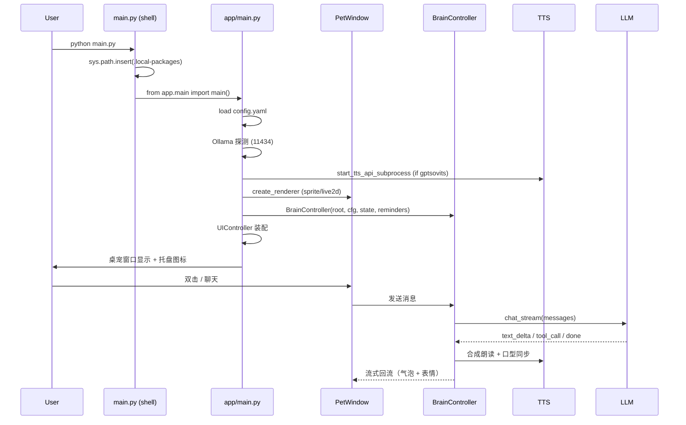
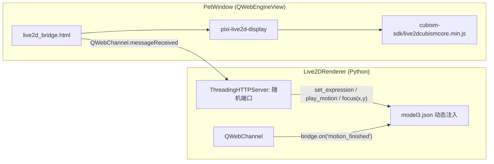
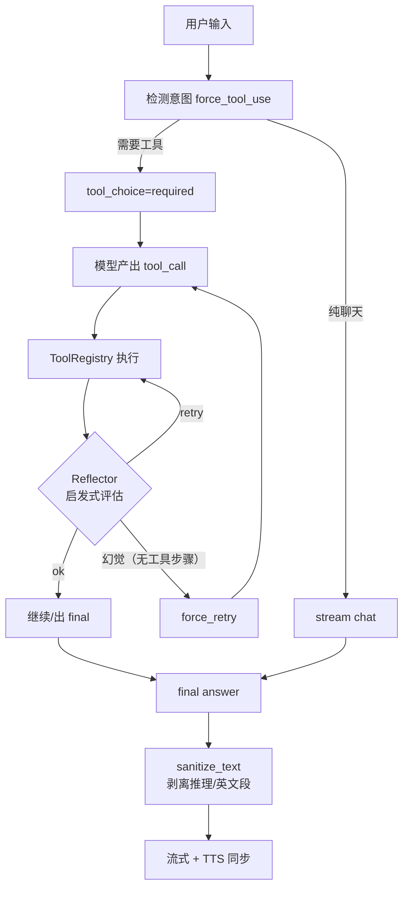

# Architecture · 顶层架构

## 启动时序



## Live2D 渲染子图



**关键点**：

- 内置 `ThreadingHTTPServer`（随机端口）绕过 Chromium CORS，让 PIXI 能直接 `fetch('model3.json')`
- HTTP handler 回传 `model3.json` 时**动态注入** `Motions`（idle / Zzz）与 `Expressions` 段 —— 原模型文件不动，桥端自动循环待机动作
- `*.model.yaml`（`assets/live2d_profiles/`）按五段声明每个模型的能力：emotions / actions / sleep / watermark / random_expression

## Agent 调用流程



**抗幻觉 3 层**：
1. **意图驱动 force_tool_use**：检测「打开XX/提醒XX/记住XX/查询」类意图，第一轮请求自动带 `tool_choice="required"`
2. **强制重试 force_retry**：模型仍只回文字 → 注入强提示重试一次
3. **强制 final 阶段**：连续多轮纯调工具无文字 → 去掉 tools 强制模型给出 final answer

详见 [dev-testing.md](dev-testing.md) 的 `tests/test_anti_hallucination*.py` 回归测试。

## 文件分层

```
┌─────────────────────────────────────────────────┐
│  UI: app/ui/{pet_window, chat_window, settings_window, ui_controller} │
├─────────────────────────────────────────────────┤
│  Animation: app/animation/{sprite_renderer, live2d_renderer, factory} │
├─────────────────────────────────────────────────┤
│  Brain: app/brain/{agent, llm_client, memory, proactive, langchain_agent} │
├─────────────────────────────────────────────────┤
│  Voice: app/voice/{voice, gptsovits_tts, minimax_tts, asr, character} │
├─────────────────────────────────────────────────┤
│  Engine: app/engine/{state, tools/*, chat_store, reminder, dashboard} │
├─────────────────────────────────────────────────┤
│  Core: app/core/{config, settings_store, save, tray, app_registry} │
├─────────────────────────────────────────────────┤
│  Infra: MCP, Web Dashboard, Eval, Agents (sub-agents) │
└─────────────────────────────────────────────────┘
```